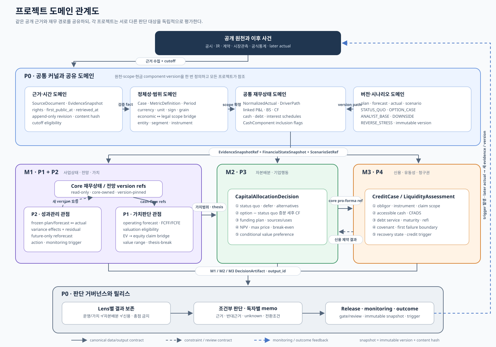

# P0 도메인 중심 구현 방향성

> 버전: 0.1  
> 작성일: 2026-09-04 (KST)  
> 문서 지위: P0~P4의 기능 설계를 도메인 경계·객체·불변조건·계약으로 옮기는 구현 companion  
> 우선순위: 충돌 시 `P0_통합_기업재무_의사결정_시스템_마스터_설계서.md`와 각 프로젝트 상세 설계서가 우선  
> 관계도: [P0 프로젝트 도메인 관계도](P0_프로젝트_도메인_관계도.svg)



---

## 0. 이 문서가 바꾸는 관점

기능 기준 구현은 수집기, 계산기, dashboard, memo generator처럼 **무엇을 실행하는가**를 중심으로 코드를 나눈다. 도메인 기준 구현은 다음을 먼저 묻는다.

1. 어떤 시점에 무엇이 공개되어 있었는가?
2. 어떤 경제적 범위와 법적 범위를 판단하는가?
3. 어떤 재무상태·전망·대안을 비교하는가?
4. 누구의 어떤 claim 또는 의사결정을 평가하는가?
5. 어떤 규칙이 항상 참이어야 하며, 어떤 정보 부족이 결론을 제한하는가?

따라서 이 시스템의 core domain은 “공시 수집”이나 “재무비율 계산” 자체가 아니다.

> **정의된 기준시점의 공개증거를 versioned financial state로 만들고, 서로 다른 판단 lens에서 조건부 decision state를 재현하는 것**이 core domain이다.

수집·저장·차트·문서 출력은 이를 지원하는 adapter 또는 application use case다.

---

## 1. 최상위 구현 결정

### 1.1 Modular monolith

첫 구현은 하나의 repository와 하나의 실행환경을 사용하는 **modular monolith**로 만든다.

- bounded context별 Python package와 소유 데이터는 분리한다.
- context 사이에는 versioned contract만 전달한다.
- microservice, message broker, event sourcing, CQRS는 기본 전제가 아니다.
- 두 번째 source adapter, 두 번째 case 또는 독립 배포 필요가 실제로 나타나기 전에는 generic plugin framework를 만들지 않는다.
- 분석 규모보다 temporal integrity와 계산 일관성이 우선이다.

### 1.2 프로젝트와 bounded context의 관계

| 설계 문서 | 구현 경계 | 도메인 역할 |
|---|---|---|
| P0 | Shared Kernel + 공통 supporting context | 근거·시간·범위·재무상태·version·scenario·release |
| P1 | M1의 Operating & Valuation subdomain | 회사 economics, operating forecast, valuation, thesis |
| P2 | M1의 Performance & Reforecast subdomain | 계획·이전전망 대비 실적차이, 재전망, action |
| P3 | M2 Capital Allocation bounded context | status quo와 대안의 증분가치·자금조달·반전조건 |
| P4 | M3 Credit, Liquidity & Claims bounded context | obligor 지급능력, instrument 손실·회수, monitoring |

P1과 P2는 서로 다른 재무 코어가 아니다. 하나의 M1 안에서 같은 operating model과 forecast book을 사용하는 두 application 관점이다.

### 1.3 네 가지 최상위 불변조건

1. **Canonical calculation:** 같은 economic fact·driver·cash component는 한 번만 계산한다.
2. **Temporal integrity:** 사실·가정·전망·결론은 해당 cutoff에서 이용 가능했던 version에 고정된다.
3. **Unknown is not zero:** 공개되지 않은 값은 0이나 false가 아니라 명시적 knowledge state다.
4. **Non-compensatory gates:** material gate 실패는 다른 강점이나 총점으로 상쇄하지 않는다.

---

## 2. 공통 Ubiquitous Language

프로젝트마다 같은 단어를 다른 뜻으로 사용하지 않는다.

| 용어 | 도메인 의미 |
|---|---|
| `Case` | 하나의 의사결정 질문·관점·cutoff·scope를 묶는 분석 단위 |
| `SourceDocument` | 공시·IR·계약·통계 등 원문 객체 |
| `EvidenceSnapshot` | source의 공개시점·retrieval·rights·hash가 고정된 불변 참조 |
| `Fact` | 원문에서 직접 확인한 값. claim tag `[F]`를 사용한다. |
| `DerivedValue` | `Fact`에서 재현 가능한 식으로 계산한 값. lineage와 claim tag `[D]`를 사용한다. |
| `MetricDefinition` | metric의 의미·grain·기간·단위·부호·formula·source 우선순위 |
| `FinancialStateVersion` | 특정 cutoff·scope의 정규화 actual·재무제표·cash·debt 상태 |
| `ForecastVersion` | 특정 forecast origin에서 freeze된 analyst plan 또는 forecast |
| `ScenarioPath` | 조건부 driver 경로. analyst best estimate인 forecast와 구분 |
| `CashComponent` | 한 번 계산되고 lens별 포함 flag로 소비되는 현금 항목 |
| `DecisionBoundary` | 결론이 달라지는 metric·상태·사건과 그 근거 |
| `ObligationEvent` | 이자·원금·수수료·보증 현실화 등 지급시점이 있는 의무 |
| `DecisionState` | 해당 lens의 조건부 결과. 실제 회사 승인상태가 아님 |
| `Release` | input·code·config·gate·output hash를 고정한 검토·공개 단위 |

### 2.1 공통 Value Object

다음 값은 primitive string·float만으로 흘리지 않고 의미를 가진 value object 또는 검증된 record로 취급한다.

- `Money(amount: Decimal, currency, unit)`
- `Period(start, end, period_type)`
- `PublicationMoment(event_at, first_public_at, retrieved_at)`
- `ScopeRef(economic_scope_id, legal_entity_id, segment_id, instrument_id)`
- `VersionRef(version_id, version_type, publication_status, supersedes_version_id)`
- `Provenance(source_id, content_hash, mapping_version, claim_tag)`
- `KnowledgeState(KNOWN, UNKNOWN, NM, NOT_APPLICABLE, NOT_TESTABLE_FROM_PUBLIC_DATA, WITHHELD)`
- `CashInclusionFlags(FCFF, FCFE, CFADS, debt_service, liquidity, sources_uses)`

---

## 3. P0 — 공통 Program Domain

P0는 하나의 거대한 aggregate가 아니다. 여러 프로젝트가 공유하는 최소 언어와 다음 네 supporting context를 제공한다.

### 3.1 Case & Release Governance Context

**도메인 질문:** 무엇을, 누구의 관점에서, 어느 시점까지 판단하며 공개 가능한가?

Aggregate roots:

- `Case`: decision question, perspective, as-of, cutoff, horizon, active module, intended/prohibited use
- `Release`: 고정된 core/module version, gate result, review state, publication state, hash, limitation

핵심 규칙:

- 한 case가 모든 module을 활성화할 필요는 없다.
- 같은 회사를 P1~P4에 강제하지 않는다.
- source·formula·judgment가 바뀌면 새 release를 만든다.
- `coverage_state`, `review_state`, `publication_state`는 서로 다른 축이다.
- 기존 release를 수정하지 않고 새 release가 이전 release를 supersede한다.

### 3.2 Evidence & Temporal Context

**도메인 질문:** 그 사실은 언제, 어떤 권리로, 어떤 원문에서 알 수 있었는가?

Aggregate roots:

- `SourceSnapshot`: document ID, location, rights, content hash, retrieval
- `EvidenceRecord`: source 위치, claim, event/period, first-public, mapping lineage

핵심 규칙:

- raw source와 fact는 append-only다.
- `first_public_at`, `retrieved_at`, `event_at`, `period_end`를 합치지 않는다.
- ex-ante 사용 가능성은 `first_public_at <= analysis_cutoff`로 판단한다.
- amendment/restatement는 원본을 덮지 않는 새 revision이다.
- 권리가 확인되지 않은 원문은 locator-only 또는 quarantined state로 둔다.

### 3.3 Scope & Financial Semantics Context

**도메인 질문:** 이 숫자는 어느 회사·법인·segment·instrument의 어떤 의미인가?

Aggregate roots:

- `MetricCatalog`: metric definition과 mapping version
- `ScopeModel`: economic scope와 legal entity/instrument scope의 bridge

핵심 규칙:

- consolidated/standalone, balance/flow, quarter/YTD를 명시한다.
- economic scope와 legal claim scope는 별도 축이며 bridge 없이 동일시하지 않는다.
- metric 비교 전 scope·period·currency·unit·sign·grain이 호환되는지 확인한다.
- company-specific XBRL tag와 normalization 판단을 versioned mapping으로 보존한다.

### 3.4 Financial Core & Scenario Context

**도메인 질문:** 공개 actual과 driver가 일관된 P&L·BS·CF·cash·debt 상태로 어떻게 연결되는가?

Aggregate roots:

- `FinancialModel`: driver tree, schedule, linked statements와 cash/debt identity
- `FinancialStateVersion`: frozen normalized actual 또는 forecast state
- `ScenarioSet`: purpose별 driver path와 dependency

핵심 규칙:

- P&L·BS·CF, cash roll-forward와 debt roll-forward가 대사되어야 한다.
- 하나의 `CashComponent`를 한 번 계산하고 lens별 inclusion flag로 소비한다.
- version type과 publication status를 섞지 않는다.
- plan·forecast·scenario·actual은 의미와 저장 version이 다르다.
- shock·threshold는 고정 상수가 아니라 history, guidance, market evidence, contract boundary 또는 break-even/switching value에서 도출한다.

P0가 발행하는 핵심 output은 `EvidenceSnapshotRef`, `FinancialStateSnapshot`, `ScenarioSetRef`, `CoreReleaseRef`다. `OperatingBaselineRef`와 `ReforecastSnapshotRef`는 별도 재무모델이 아니라 `FinancialStateVersion`의 용도별 immutable projection이다.

---

## 4. P1 — Operating Model & Valuation Domain

P1은 M1 안에서 **사업상태와 가치**를 판단한다.

### 4.1 도메인 질문

- 회사의 revenue·cost·working capital·capex·capital structure를 움직이는 material driver는 무엇인가?
- 어떤 operating path가 지속 가능한 financial state와 가치범위를 만드는가?
- 시장가격 또는 기업가치 결론을 깨는 thesis-break는 무엇인가?

### 4.2 Aggregate와 객체

Aggregate root:

- `ValuationCase`: method eligibility, valuation run, claim bridge, thesis

주요 entities/value objects:

- core-owned reference: `DriverPathRef`, `FinancialStateRef`, `ForecastVersionRef`, `CashComponentRef`
- `ValuationMethod`, `PeerSet`, `ClaimBridge`, `Thesis`, `CounterThesis`, `Catalyst`
- `ForecastHorizon`, `CashFlowBasis(FCFF/FCFE)`, `DiscountRateBasis`, `TerminalState`, `ValuationRange`

P1은 driver tree, supporting schedule, linked statement 또는 cash/debt path를 소유하거나 재계산하지 않는다. 이를 만든 `financial_core`의 version-pinned reference를 소비해 가치판단만 소유한다.

### 4.3 불변조건

- 공개 KPI가 없으면 존재하지 않는 product/segment driver를 actual처럼 만들지 않는다.
- driver·margin·reinvestment·working capital·capital structure의 장기상태가 서로 일관되어야 한다.
- FCFF에는 WACC, FCFE에는 cost of equity처럼 cash-flow claim과 discount-rate claim을 맞춘다.
- EV에서 equity value로 갈 때 debt, cash, non-operating asset, debt-like item과 share count의 기준일을 맞춘다.
- DCF terminal state 또는 peer comparability를 방어할 수 없으면 해당 방법을 비활성화한다.
- valuation output은 단일 정답이 아니라 범위·assumption·thesis-break를 포함한다.

### 4.4 계약

Consumes:

- `EvidenceSnapshotRef`
- `FinancialStateSnapshot` 또는 그 projection인 `OperatingBaselineRef`
- `ScenarioSetRef`

Publishes:

- `ValuationAssessment`: method eligibility, value range, claim bridge, thesis-break

P1은 variance와 reforecast workflow를 소유하지 않는다. P2의 `ReforecastChangeSet`을 `financial_core`가 적용해 새 `ReforecastSnapshotRef`를 발행하면, P1은 그 version을 참조해 새 valuation version을 만든다.

---

## 5. P2 — Performance & Reforecast Domain

P2는 M1 안에서 **실적차이와 전망 갱신**을 판단한다.

### 5.1 도메인 질문

- 실제는 freeze된 plan 또는 prior forecast와 왜 달라졌는가?
- 어떤 driver assumption이 무효화되었는가?
- 실제가 공개된 기간을 잠근 뒤 미래 전망과 action을 어떻게 바꿔야 하는가?

### 5.2 Aggregate와 객체

Aggregate root:

- `PerformanceReview`: actual comparison, variance explanation, reforecast change, action link

주요 entities/value objects:

- core-owned reference: `ForecastVersionRef`, `ActualSnapshotRef`, `MetricSeriesRef`
- `VarianceEffect`, `VarianceResidual`, `RiskOpportunity`, `Action`, `MonitoringTrigger`
- `ForecastOrigin`, `VarianceConvention`, `PlanningCadence`, `ComparableActualKey`, `DriverChange`

P2는 plan·forecast·actual version의 의미와 비교·변경 결정을 소유하지만, 새 linked statements와 cash/debt path 계산은 `financial_core`에 `ReforecastChangeSet`으로 요청한다.

### 5.3 불변조건

- performance 비교에는 actual 공개 전에 freeze된 비교가능 version만 사용한다.
- public guidance, analyst plan, analyst forecast, scenario와 public actual을 혼합하지 않는다.
- actual과 비교대상의 metric·scope·period·currency·unit을 맞춘다.
- `total variance = driver effects + explicit residual`이 성립해야 한다.
- actual이 공개된 기간은 lock하고 미래기간만 새 forecast version으로 갱신한다.
- forecast 수정은 기존 version overwrite가 아니라 새 `version_id`와 supersession이다.
- action owner는 실제 조직의 확정 책임자가 아니라 `proposed_accountable_role`이다.

### 5.4 계약

Consumes:

- P0의 `OperatingBaselineRef`
- freeze된 `ForecastVersionRef`
- 새 `FinancialStateSnapshot(version_type=PUBLIC_ACTUAL)`

Publishes:

- `VarianceAssessment`
- `ReforecastChangeSet`
- `ActionTriggerSet`

`financial_core`는 검증된 `ReforecastChangeSet`을 canonical model에 적용하고 새 `ReforecastSnapshotRef`를 발행한다. 이 reference는 P1 가치평가, P3 status quo, P4 cash/debt stress가 함께 소비하는 immutable financial path다.

---

## 6. P3 — Capital Allocation & Corporate Action Domain

P3는 독립적인 M2 bounded context로 **어떤 대안을 선택할 것인가**를 판단한다.

### 6.1 도메인 질문

- 현상유지, 연기, 자체투자, 제휴, 인수, 매각, 자본환원 또는 deleveraging 중 어떤 대안이 증분가치를 만드는가?
- 자금조달·유동성·실행 제약을 고려하면 선호대안이 달라지는가?
- 어느 가격·매출·margin·synergy·시점에서 결론이 뒤집히는가?

### 6.2 Aggregate와 객체

Aggregate root:

- `CapitalAllocationDecision`

주요 entities/value objects:

- `Alternative`, `StatusQuo`, `DecisionVersion`, `IncrementalCashFlowLine`
- `FundingPlan`, `TransactionTerm`, `ProFormaState`, `Synergy`, `DisSynergy`, `ExecutionRisk`
- `OptionType`, `AfterTaxCashFlow`, `OpportunityCost`, `Cannibalization`
- `NPV`, `IRR`, `ROIC`, `MaximumPrice`, `BreakEven`, `SwitchingValue`

### 6.3 불변조건

- 정확히 하나의 status quo가 있고 `defer`와 구분된다.
- 모든 대안은 같은 pinned core release, cutoff, scope, horizon, currency와 tax basis에서 비교한다.
- `Incremental CF = CF(option world) - CF(status quo world)`를 사용한다.
- sunk cost는 제외하고 opportunity cost·cannibalization·synergy·dis-synergy는 포함 여부를 명시한다.
- project economics와 financing cash를 분리하고 initial outlay·tax·funding을 한 번만 반영한다.
- accounting profit·EPS accretion을 가치창출과 동일시하지 않는다.
- sources와 uses가 일치해야 한다.
- material funding이 필요한 대안은 M3의 constraint result 없이 최종 `ConditionalCapitalDecision`을 발행할 수 없다.

### 6.4 계약

Consumes:

- `OperatingBaselineRef` 또는 최신 `ReforecastSnapshotRef`
- `ValuationAssessment`
- `ScenarioSetRef`
- M3의 `FinancingConstraintResult`

Publishes:

- `CapitalOptionEvaluation`
- `CapitalActionFundingEvents`
- `ConditionalCapitalDecision`

P3가 P4에 보내는 funding event에는 최소 다음이 포함된다.

```text
option_id
incremental_operating_cash
transaction_fee
funding_draw
principal_repayment
pro_forma_debt
action_timing
legal_entity_allocation
```

---

## 7. P4 — Credit, Liquidity & Claims Domain

P4는 독립적인 M3 bounded context로 **누가 무엇을 언제 갚을 수 있으며, 실패 시 어떤 claim이 남는가**를 판단한다.

### 7.1 도메인 질문

- 정의된 obligor와 instrument가 운영현금·가용현금·facility로 원리금을 지급할 수 있는가?
- 최초 cash shortfall·covenant crossing·refinancing gap은 언제 발생하는가?
- 특정 instrument의 담보·보증·우선순위와 공개정보가 어떤 recovery state를 지지하는가?

### 7.2 Aggregate와 객체

Aggregate roots:

- `CreditCase`: 관점, obligor, instrument, jurisdiction, horizon, pinned core release
- `DebtPortfolio`: debt·facility·interest·maturity·obligation ledger
- `LiquidityAssessment`: accessible cash, CFADS, debt service, trough, refinancing
- `CovenantPackage`: exact definition, testability, headroom, cure/breach path
- `RecoveryCase`: opt-in legal-entity value pool과 claim waterfall

주요 entities/value objects:

- `LegalEntityNode`, `Obligor`, `DebtInstrument`, `Facility`, `ObligationEvent`
- `CashAccount`, `CashSource`, `Maturity`, `InterestTerm`, `Covenant`
- `Collateral`, `Guarantee`, `Claim`, `ClaimClass`, `MarketObservation`
- `AccessibleCash`, `CFADS`, `DebtService`, `CommitmentState`, `CovenantState`, `RecoveryState`

P4의 `DebtPortfolio`는 obligor·instrument·claim의 법적 분류와 obligation 해석을 소유한다. 금액·지급시점·cash/debt roll-forward는 `financial_core` reference를 사용하며 baseline을 복제하거나 재계산하지 않는다.

### 7.3 불변조건

- consolidated cash는 obligor가 자유롭게 쓸 수 있는 accessible cash와 같지 않다.
- debt face, carrying amount와 contractual cash flow를 구분한다.
- committed, drawable, uncommitted refinancing source를 구분한다.
- facility draw는 cash, debt, undrawn amount, interest, maturity와 covenant에 같은 event로 반영한다.
- covenant threshold crossing, breach, event of default와 acceleration을 서로 다른 상태로 둔다.
- 계약 정의와 material input이 없으면 covenant는 `NOT_TESTABLE_FROM_PUBLIC_DATA`다.
- 미공개 debt·collateral·guarantee는 0이 아니라 `UNKNOWN`이다.
- PD·LGD가 없으면 임의 확률이나 expected loss를 만들지 않는다.
- recovery는 legal entity별 value pool과 claim priority를 보존하며 분배액과 residual의 합이 available value와 일치해야 한다.
- rating·spread는 외부 관측이며 독립 credit conclusion을 대체하지 않는다.

### 7.4 계약

Consumes:

- `FinancialStateSnapshot`
- `OperatingBaselineRef` 또는 `ReforecastSnapshotRef`
- `ScopeBridgeRef(economic_legal_scope_bridge_id)`
- P3의 `CapitalActionFundingEvents`

Publishes:

- `FinancingConstraintResult`
- `CreditStateAssessment`
- `RecoveryAssessment`
- `CreditMonitoringTriggerSet`

P4가 P3에 돌려주는 constraint result에는 최소 다음이 포함된다.

```text
accessible_cash
cash_trough_date
mandatory_debt_service
refinancing_gap
covenant_state
first_failure_trigger
model_implied_debt_boundary
recovery_state_if_relevant
```

M3의 결론은 M2 NPV와 합산한 총점이 아니다. M2는 value preference를, M3는 funding/credit feasibility를 각각 보존한다.

---

## 8. 프로젝트 간 Contract Map

### 8.1 공통 envelope

context 간 DTO와 domain event는 필요한 범위에서 아래 envelope를 공유한다.

```text
schema_version
program_id
case_id
producer_context
release_id | core_release_id
as_of_date
analysis_cutoff
source_snapshot_hash
first_public_at
retrieved_at
economic_scope_id
economic_legal_scope_bridge_id?
legal_entity_id?
instrument_id?
period_start
period_end
period_type
currency
unit
version_id
version_type
publication_status
supersedes_version_id?
scenario_id?
scenario_purpose?
lens_id
content_hash
limitation_codes[]
```

payload 전체에 같은 scope·currency·unit을 반복하는 대신 envelope와 payload key의 호환성을 검증한다.

### 8.2 주요 계약

| Producer | Contract | Consumer | 의미 |
|---|---|---|---|
| P0 | `EvidenceSnapshotRef` | P1·P2·P3·P4 | cutoff에서 사용 가능한 원문 집합 |
| P0 | `FinancialStateSnapshot` | P1·P2·P3·P4 | 대사된 actual·cash·debt 상태 |
| P0 | `OperatingBaselineRef` | P1·P2·P3·P4 | core-owned status-quo driver와 operating/cash path |
| P0 | `ScopeBridgeRef` | P4 | economic scope와 legal entity/instrument의 versioned bridge |
| P2 | `ReforecastChangeSet` | P0 Financial Core | 미래 driver assumption 변경 요청 |
| P0 | `ReforecastSnapshotRef` | P1·P3·P4 | change set 적용·대사 후 새 미래 financial path |
| P1 | `ValuationAssessment` | P3·P0 Governance | 가치범위·claim bridge·thesis-break |
| P3 | `CapitalActionFundingEvents` | P0 Financial Core·P4 | core의 option pro-forma 생성과 P4 제약평가에 필요한 cash·funding·debt·timing 영향 |
| P4 | `FinancingConstraintResult` | P3 | cash trough·refi·covenant·debt boundary |
| M1·M2·M3 | `DecisionArtifact` | P0 Governance | lens별 결론·근거·반대근거·trigger |
| P0 Governance | `ReleaseManifest` | 독자·후속 outcome | frozen 결과와 재현 경로 |

### 8.3 M2와 M3의 왕복 처리

M2와 M3가 서로의 내부 코드를 import하거나 cash/debt path를 직접 재계산하지 않는다. application orchestration이 `financial_core`를 포함해 다음 순서를 조정한다.

```text
M2 draft option
-> CapitalActionFundingEventsV1
-> financial_core builds reconciled OPTION_CASE FinancialStateSnapshot
-> FinancingStressRequestV1(core snapshot ref)
-> M3 evaluates liquidity/credit constraints
-> FinancingConstraintResultV1
-> M2 finalizes conditional decision
```

이 구조는 도메인 피드백을 보존하면서 코드 순환의존을 막는다.

---

## 9. Domain State와 Event

### 9.1 Case lifecycle

```text
DRAFT
-> EVIDENCE_FEASIBLE
-> CORE_RECONCILED
-> MODULE_READY
-> REVIEWED
-> RELEASED
```

상태 전이는 폴더 존재 여부가 아니라 gate evidence로 결정한다. 자료범위는 `coverage_state`, 검토는 `review_state`, 공개 가능성은 `publication_state`로 따로 기록한다. 자료 부족은 `limitation_codes`와 coverage에 남기며, material gate 실패 시 `publication_state=WITHHELD`로 둔다. 이 축들을 하나의 `LIMITED` 상태로 합치지 않는다.

### 9.2 주요 domain event

- `EvidenceCaptured`
- `SourceSuperseded`
- `ActualAccepted`
- `ForecastVersionFrozen`
- `PublicActualObserved`
- `VarianceReconciled`
- `ReforecastPublished`
- `ValuationCompleted` 또는 `ValuationUnsupported`
- `AlternativeEvaluated`
- `FinancingConstraintRequested`
- `LiquidityTroughDetected`
- `FirstFailureTriggerFound`
- `DecisionBoundaryCrossed`
- `ReleasePublished` 또는 `ReleaseWithheld`
- `MonitoringTriggerFired`

초기 구현에서 event는 audit/change log를 위한 명시적 record다. event sourcing을 도입한다는 뜻은 아니다. 이후 actual은 기존 snapshot을 수정하지 않고 새 evidence와 새 version/release를 만든다.

---

## 10. 현재 코드 구조와의 매핑

```text
src/versioned_finance_core/
├─ contracts/          Shared Kernel의 ID·enum·DTO
├─ evidence/           Evidence & Temporal Context
├─ financial_core/     Scope/Semantics + Financial Core
├─ modules/
│  ├─ m1/              P1 Operating/Valuation + P2 Performance/Reforecast
│  ├─ m2/              P3 Capital Allocation
│  └─ m3/              P4 Credit/Liquidity/Claims
├─ overlays/           opt-in sector policy
├─ validation/         invariant·gate·challenge
├─ reporting/          read-only projection과 memo
└─ orchestration/      use-case 순서와 cross-context contract 전달
```

context 내부 구현은 필요에 따라 다음 세 층으로 나눈다.

1. `domain`: entity, value object, invariant, domain service
2. `application`: use case, repository port, cross-context orchestration 요청
3. `adapter`: DART/SEC/file/DuckDB/Parquet/reporting 구현

작은 context는 파일 세 개로 억지 분할하지 않는다. domain rule과 I/O가 섞이기 시작할 때 패키지로 승격한다.

### 10.1 허용 의존 방향

```text
contracts / evidence
        ↓
financial_core
        ↓
 m1     m2     m3
        ↓
reporting / orchestration
```

- reporting에서 domain 숫자를 재계산하지 않는다.
- case CSV에서 formula를 숨기지 않는다.
- module별 source ledger, historical model 또는 scenario engine을 복제하지 않는다.
- 독립 검산은 허용하되 canonical output과 구분하고 목적을 기록한다.

---

## 11. 도메인 기준 구축 순서

### D0 — Evidence-to-Release vertical slice

- `Case`, `EvidenceSnapshot`, `MetricDefinition`, `FinancialStateVersion`, `Release` 최소 계약
- source 한 건, fact 한 건, normalization 한 건
- identity 한 건, decision output 한 건, manifest hash 한 건

종료조건: source에서 release output까지 ID와 cutoff가 끊기지 않는다.

### D1 — Core operating baseline + P1 valuation

- `financial_core`의 대상 case material driver와 schedule
- `financial_core`의 linked P&L·BS·CF·cash·debt 및 status-quo version
- P1의 가능한 valuation method와 thesis-break

종료조건: core-owned `OperatingBaselineRef`가 재현·대사되고 P1이 이를 수정 없이 소비한다.

### D2 — P2 Performance cycle

- 비교 가능한 frozen forecast와 actual
- driver variance + residual
- future-only `ReforecastChangeSet`과 action trigger

종료조건: P2의 change set을 `financial_core`가 적용해 이전 version을 수정하지 않는 새 `ReforecastSnapshotRef`를 발행한다.

### D3 — P3 Capital allocation

- status quo와 1~2개 실질 대안
- 증분 세후현금흐름, funding event, break-even
- M3가 필요한 funding request

종료조건: 가치선호와 financing 제약이 분리된 조건부 decision을 낸다.

### D4 — P4 Credit and liquidity

- obligor·instrument·legal entity map
- accessible cash·CFADS·debt service·maturity/refi
- evidence-backed downside와 reverse boundary
- covenant/recovery는 공개근거 범위에서만

종료조건: `FinancingConstraintResult`와 독립 `CreditStateAssessment`를 재현한다.

### D5 — Cross-lens release

- M1·M2·M3 결과를 총점 없이 나란히 조립
- source·assumption·limitation·counterargument·trigger 연결
- review와 immutable release snapshot

종료조건: memo의 모든 material 숫자가 output ID와 release hash로 추적된다.

---

## 12. 프로젝트별 완료 의미

| 프로젝트 | 완료된 도메인 증거 |
|---|---|
| P0 | cutoff·scope·version이 보존된 evidence→financial state→release 흐름 |
| P1 | core-owned driver·linked financial reference에서 방어 가능한 valuation/thesis-break까지 연결 |
| P2 | frozen core forecast→comparable actual→variance/residual→change set/action→새 core version 연결 |
| P3 | status quo→incremental CF→funding constraint→conditional option decision 연결 |
| P4 | obligor/instrument→accessible cash/debt service→failure boundary→credit/recovery state 연결 |

화면, 파일 수, ratio 개수 또는 scenario 개수는 완료 기준이 아니다.

---

## 13. 과설계 방지 원칙

- metric 하나마다 class를 만들지 않는다. `MetricDefinition`과 typed record로 시작한다.
- 전체 `Case`를 모든 재무·대안·채무를 품는 거대 aggregate로 만들지 않는다. Release가 frozen aggregate version을 조합한다.
- 단일 case 단계에서 generic workflow engine, 규칙 DSL, plugin bus를 만들지 않는다.
- immutable version이 필요하다는 이유만으로 event sourcing을 도입하지 않는다.
- DART와 SEC의 차이를 하나의 거대한 parser 조건문으로 숨기지 않는다. source adapter는 분리하되 normalized contract는 공유한다.
- 공개 grain이 없는 상세 데이터를 가상으로 채워 generic model의 완성도를 연출하지 않는다.
- M2 value와 M3 credit을 한 score로 합치지 않는다.

도메인 모델은 현실의 모든 기업재무를 추상화하기 위한 것이 아니다. 선택한 case의 의사결정과 공개증거를 정확히 보존하는 최소 모델에서 시작하고, 두 번째 실제 사례가 첫 모델을 깨는 지점에서 확장한다.
