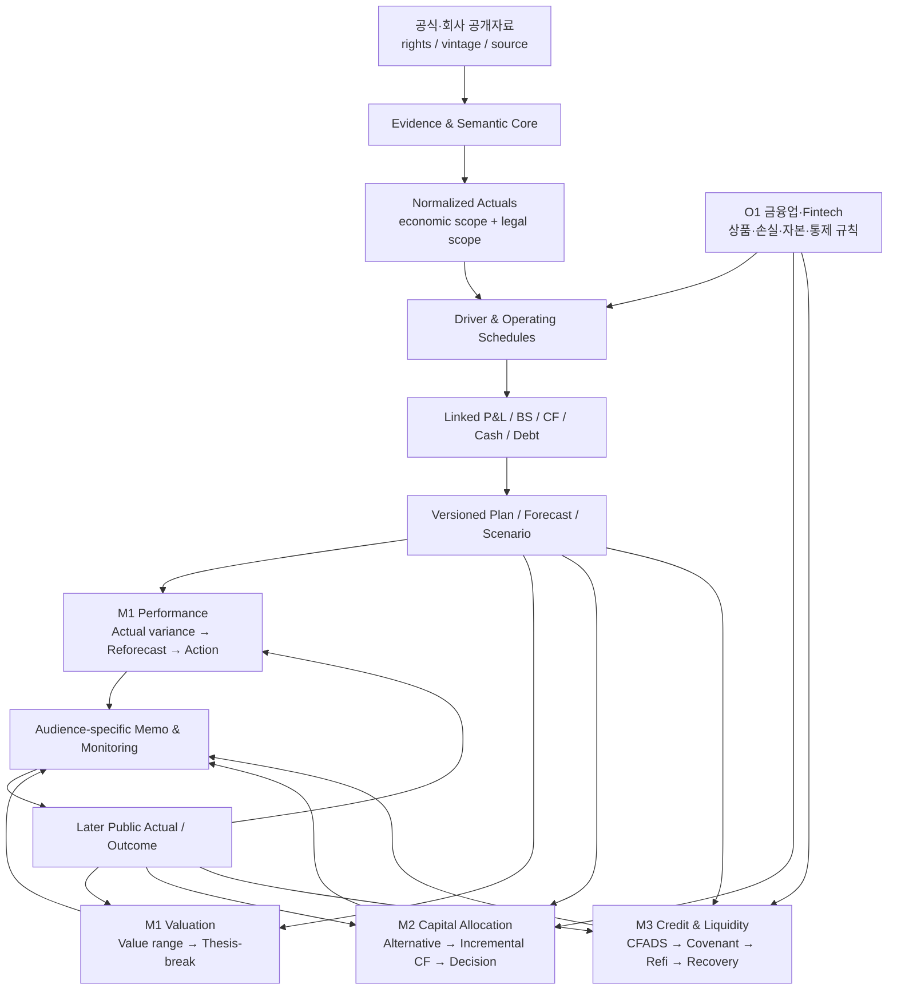

# P0 통합 마스터 설계서: Public-Data Corporate Finance Decision System

> 버전: 1.0  
> 기준일: 2026-09-01 (KST)  
> 문서 지위: P1~P4의 공통 계약·구축 순서·중복 제거를 정하는 상위 설계서  
> 상세 규격: 기존 P1~P4 문서를 모듈 annex로 보존  
> 프로젝트 성격: 민간이 합법적으로 재확보할 수 있는 공개자료 기반 개인 학습·채용 포트폴리오

---

## 0. 통합 결정

### 0.1 최종 구조

기존 P1~P5를 서로 독립된 다섯 프로젝트로 만들지 않는다. 하나의 프로그램 아래 공통 코어와 독립적으로 release 가능한 판단 모듈을 둔다.

| 새 구조 | 흡수하는 기존 설계 | 통합 수준 | 독립 release |
|---|---|---|---|
| **M1 Operating, Forecast & Valuation Core** | P1 + P2 | 데이터·재무모델·forecast·validation을 완전 통합 | 가능 |
| **M2 Capital Allocation & Corporate Action** | P3 | 공통 재무·현금·scenario는 M1 재사용, 의사결정 객체는 분리 | 가능 |
| **M3 Credit, Liquidity & Claims** | P4 | 공통 재무·현금·scenario는 M1/M2와 공유, 신용·청구권 판단은 분리 | 가능 |
| **O1 Financial Services & Fintech Product Economics and Risk Constraints Overlay** | P5 | 별도 엔진이 아니라 M1~M3의 금융업·상품별 규칙 | 조건부 case release |

핵심 포트폴리오 한 줄은 다음과 같다.

> 공개증거를 versioned operating model로 정규화하고, 실적 차이를 재전망·가치·자본배분·신용 제약으로 전파해 독자별 조건부 memo와 monitoring trigger로 닫는 개인 corporate-finance decision system.

### 0.2 합치는 이유

- CFA의 Financial Modeling 모듈은 revenue, cost, working capital, capital structure와 세 재무제표를 하나의 모델로 연결한다. 같은 역사재무와 driver를 프로젝트마다 다시 만들 이유가 없다.  
  근거: [CFA Financial Modeling](https://www.cfainstitute.org/programs/cfa-program/candidate-resources/practical-skills-modules/financial-modeling)
- CFA의 Company Analysis: Forecasting은 revenue·cost·working capital·capex·capital structure와 scenario를 하나의 forecasting flow로 다룬다.  
  근거: [CFA Company Analysis: Forecasting](https://www.cfainstitute.org/insights/professional-learning/refresher-readings/2026/company-analysis-forecasting)
- AFP는 FP&A를 integrated planning·forecasting, performance management, financial analysis를 통한 business decision support로 정의하고, integrated planning system이 일관된 가정을 쓰는 satellite model과 연결되어야 한다고 설명한다.  
  근거: [AFP — What is FP&A?](https://fpacert.financialprofessionals.org/certification/what-is-fp-a), [AFP — Finance Business Partnering](https://www.financialprofessionals.org/glossary/finance-business-partnering)
- CFA의 자본배분 기준은 대안별 세후 증분현금흐름과 전사 영향을 요구한다. 이는 M1의 status-quo forecast를 입력으로 쓰되, P3의 counterfactual 판단은 별도 모듈로 유지해야 한다는 근거다.  
  근거: [CFA Capital Investments and Capital Allocation](https://www.cfainstitute.org/insights/professional-learning/refresher-readings/2026/capital-investments-and-capital-allocation)
- CFA의 corporate credit 분석은 사업·산업·지배구조, 재무제표, 현금흐름 전망, 유동성·레버리지·coverage와 담보·선순위를 결합한다. 동일 operating path를 쓰더라도 판단대상은 주식가치가 아니라 채무이행과 loss severity다.  
  근거: [CFA Credit Analysis for Corporate Issuers](https://www.cfainstitute.org/insights/professional-learning/refresher-readings/2026/credit-analysis-for-corporate-issuers)
- ICAEW는 input→process→output의 명확한 흐름, 계산 재사용, 내장 checks, 위험에 비례한 review를 권고한다. 공통 계산을 여러 파일에 복제하는 것보다 한 번 계산하고 모듈이 참조하는 구조가 이 원칙에 부합한다.  
  근거: [ICAEW Twenty Principles for Good Spreadsheet Practice](https://www.icaew.com/technical/technology/excel-community/20-principles-for-good-spreadsheet-practice-2024-edition)

### 0.3 합치지 않는 것

다음 판단을 하나의 점수·메모·현금지표로 압축하지 않는다.

| 구분 | M2 자본배분 | M3 신용·유동성 |
|---|---|---|
| 관점 | 경영진·주주·자본배분자 | lender·bondholder·treasury |
| 분석 단위 | 전사·segment·product·거래대상 | legal entity·obligor·instrument·claim |
| 비교 | option world − status quo | 지급재원 − 계약상 의무 |
| 핵심 현금 | incremental FCFF/FCFE·project CF | accessible cash·CFADS·debt service |
| 목적함수 | NPV·가치창출·max price | 지급능력·cash gap·loss severity |
| 실패조건 | 대안열위·NPV≤0·자본제약 | cash floor·covenant·payment·refi failure |
| 결론 | analyst-preferred option | conditional credit state |

M2의 NPV를 CFADS로 바꾸지 않고, M3의 recovery를 equity valuation으로 대신하지 않는다. 두 결과는 공통 driver path 위에서 나란히 보여준다.

---

## 1. 사용자 제약과 주장 경계

### 1.1 사용자 전제

- 이 프로젝트는 특정 지원기업용 과제가 아니라 CEO Staff·전략·BizOps·FP&A·CorpDev·Equity/Credit RA·Treasury에서 재사용할 금융 의사결정 증거다.
- 정규직 전환은 목표가 아니다. 짧은 고정기간 역할에서도 검토·인수인계 가능한 decision asset을 남기는 능력을 보여준다.
- FinDone은 본인 사용을 위해 만든 제품이다. 외부 사용자 성장, 시장검증, 조직 도입을 주장하지 않는다.
- 현재 공고나 특정 JD를 case 선정의 선행조건으로 쓰지 않는다. 완성 후 관련 역량만 지원서에 mapping한다.

### 1.2 허용 주장

- 공개자료를 정규화해 model·memo·monitoring pack을 **제작했다**.
- 공개된 기준일 정보로 scenario·valuation·stress를 **계산·시뮬레이션했다**.
- 공식 원문과 계산을 대사하고 제한사항을 **검증·문서화했다**.
- historical vintage가 있는 경우 당시 정보만으로 outcome analysis를 **수행했다**.

### 1.3 금지 주장

- 실제 회사가 모델을 도입하거나 경영진·투자위원회·신용위원회가 사용했다는 주장
- 개인 프로젝트 결과를 실제 투자·대출·board 승인으로 표현
- 공개되지 않은 내부 budget, 고객·거래 데이터, covenant, 담보·보증을 아는 것처럼 표현
- 합성데이터를 실제 관측치나 성과로 표현
- FinDone의 외부 사용자 성장·상업적 validation을 근거 없이 표현
- 모델 결과를 투자·법률·회계·세무 자문 또는 agency-equivalent rating으로 표현

### 1.4 공통 라벨

근거 유형:

- `[STD]`: 공식 기준·법령·전문기관 방법론
- `[EVID]`: 공시·IR·정부통계·시장 원천자료
- `[USER]`: 사용자가 명시한 목적·제약
- `[CALC]`: 재현 가능한 계산
- `[JUDG]`: 분석가 판단·설계 선택

주장 유형:

- `[F] Fact`: 원문에 직접 존재
- `[D] Derived`: 공개 숫자에서 재현 가능하게 계산
- `[A] Assumption`: 모델을 위해 둔 명시적 가정
- `[I] Inference`: 여러 사실을 연결한 해석
- `[R] Recommendation`: 조건부 행동 제안
- `[M] Measured`: 직접 수행한 test·benchmark 결과

---

## 2. 프로그램 아키텍처



### 2.1 한 번만 구현하는 공통 자산

- case charter, intended/prohibited use
- source/evidence/rights/vintage ledger
- raw snapshot, receipt/accession ID, hash
- entity·segment·instrument·period·currency dimension
- account mapping, normalization, metric dictionary
- public actual fact table
- driver tree, operating schedules, integrated P&L·BS·CF
- working capital, capex, tax, cash, debt·interest schedules
- plan·forecast·scenario version register
- scenario driver paths
- assumption·decision·change·review log
- formula, reconciliation, boundary, known-answer test
- independent/effective challenge 기록
- read-only release snapshot, handover, reproduction guide

### 2.2 모듈별로만 구현하는 자산

**M1 Performance**

- public target·analyst plan·analyst forecast·public actual의 의미 분리
- actual-to-plan·actual-to-prior-forecast variance
- price·volume·mix, cost, working-capital, cash bridge와 residual
- immutable forecast version, supersession, rolling reforecast
- risk/opportunity·action register와 proposed owner

**M1 Valuation**

- DCF·relative·reverse valuation의 eligibility와 선택 이유
- operating/non-operating asset, debt-like item, equity claim bridge
- terminal state, peer selection·exclusion, market-implied expectation
- thesis, catalyst, counter-thesis, thesis-break

**M2 Capital Allocation**

- status quo·defer·build·buy·partner·divest·return·deleveraging 대안
- 증분 세후현금흐름, NPV·IRR·ROIC·max price·break-even
- synergy·dis-synergy·cannibalization·opportunity cost
- sources/uses, pro forma, integration/execution risk, managerial flexibility

**M3 Credit & Liquidity**

- borrower·legal entity·obligor·instrument·claim scope
- accessible cash, facility, debt service, maturity·refinancing
- covenant definition·testability·headroom·breach path
- collateral·guarantee·seniority·claim priority·recovery
- rating·spread·market signal의 독립 비교

---

## 3. 데이터 정책: 민간 재확보 가능성이 필수

### 3.1 비보상적 데이터 gate

다음 조건 중 하나라도 핵심 분석에서 실패하면 case를 바꾸거나 해당 모듈을 비활성화한다.

1. 고용·계약·감독관계 없이 민간이 합법적으로 접근 가능하다.
2. 핵심 결론은 무료 `PUBLIC_OFFICIAL` 또는 `PUBLIC_COMPANY` 자료로 재현된다.
3. source URL·접수번호·공개시각·기간·단위·연결/별도·정정 여부를 기록할 수 있다.
4. 당시 판단을 재현하려면 first-public vintage를 보존할 수 있다.
5. 이용약관·상업적 이용·변경·재배포·출처표시 조건을 확인할 수 있다.
6. API 추출값을 원문과 sample 또는 material total로 대사할 수 있다.
7. private estimate가 필요한 핵심 input을 실제값처럼 만들지 않는다.

### 3.2 접근 분류

| 분류 | 사용 | 공개 release |
|---|---|---|
| `PUBLIC_OFFICIAL` | 핵심 core | 원문 link·허용 범위 내 snapshot |
| `PUBLIC_COMPANY` | 핵심 core | 회사 원문 link·필요한 짧은 발췌 |
| `PUBLIC_REGULATORY` | 적용성·법적 구조 | 관할·기준일 표시 |
| `LICENSED_OPTIONAL` | 선택 cross-check | 라이선스가 허용하는 locator·요약만 |
| `ACCOUNT_OR_FEE_ACCESSIBLE` | 보조 확인 | core dependency 금지, 접근비용·coverage 표시 |
| `SYNTHETIC_TEST` | 계산·통제 test fixture | 실제 회사 증거와 분리 |
| `INTERNAL_OR_CONFIDENTIAL` | 사용 금지 | 사용 금지 |

### 3.3 합성데이터 규칙

- formula, boundary, failure-handling, refresh/rollback test에만 사용한다.
- 실제 조직의 budget·forecast·고객·거래·성과로 표현하지 않는다.
- 합성 생성규칙, seed 또는 입력범위, expected result를 test 문서에 기록한다.
- 합성 결과로 시장규모, ROI, 투자성과, 신용성과를 주장하지 않는다.

### 3.4 기본 공개원천

- 한국 공시·재무: [OpenDART](https://opendart.fss.or.kr/intro/main.do), [KIND](https://kind.krx.co.kr/), [KRX 정보데이터시스템](https://data.krx.co.kr/contents/MDC/MAIN/main/index.cmd)
- 거시·산업: [한국은행 ECOS](https://ecos.bok.or.kr/api/), [KOSIS OpenAPI](https://sso.kosis.kr/serviceInfo/openAPIGuide.do)
- 미국 공시: [SEC Search Filings and EDGAR APIs](https://www.sec.gov/search-filings)
- 회계기준: [IFRS Standards](https://www.ifrs.org/issued-standards/list-of-standards/)
- 회사 공식 IR, earnings release, transaction announcement, 가격표, 제품·계약 설명서

개별 원천의 제공 사실은 개별 row의 정확성·비교가능성·재배포 권한을 자동 보증하지 않는다. case별 source register가 우선한다.

---

## 4. 공통 semantic·version 계약

### 4.1 필수 식별자

```text
program_id
case_id
release_id
as_of_date
first_public_at
retrieved_at

economic_scope_id
legal_entity_id
instrument_id
economic_legal_scope_bridge_id

period_start
period_end
period_type
currency
unit

version_id
version_type
publication_status
supersedes_version_id

scenario_id
scenario_purpose
lens_id
```

### 4.2 version 의미

`version_type`:

- `PUBLIC_TARGET_OR_GUIDANCE`
- `ANALYST_PLAN`
- `ANALYST_FORECAST`
- `SCENARIO`
- `PUBLIC_ACTUAL`
- `EXTERNAL_ESTIMATE`

`publication_status`:

- `PRELIMINARY`
- `FILED`
- `REVISED`
- `RESTATED`

실제값의 정정상태와 정보가 시장에 공개된 시점을 하나의 필드로 합치지 않는다. `latest_restated`를 역사적 ex-ante 판단에 소급해 넣지 않는다.

### 4.3 관점과 현금 포함 규칙

```text
perspective_id:
  CORPORATE_VALUE
  PERFORMANCE_MANAGEMENT
  ISSUER_CAPACITY
  INSTRUMENT_RECOVERY

cash_component_id
included_in_fcff
included_in_fcfe
included_in_cfads
included_in_debt_service
included_in_liquidity
included_in_sources_uses
tax_basis
obligation_id
funding_source_id
```

하나의 현금 component를 한 번 계산하되, 관점별 포함 여부를 명시해 이중계상을 막는다.

### 4.4 scenario 목적

- `STATUS_QUO`
- `OPTION_CASE`
- `ANALYST_BASE`
- `EVIDENCE_DOWNSIDE`
- `REVERSE_STRESS`

scenario 수와 충격 폭은 고정하지 않는다. 역사적 분포, 공식 guidance, market evidence, contract boundary, break-even 또는 switching value에서 도출한다.

---

## 5. M1 Operating, Forecast & Valuation Core

### 5.1 핵심 질문

1. 사업·현금·가치를 움직이는 material driver는 무엇인가?
2. 계획·이전 forecast와 실제의 차이는 왜 발생했는가?
3. 최신 정보로 재전망하면 P&L·BS·CF·현금·가치가 어떻게 바뀌는가?
4. 어떤 action·thesis-break·monitoring trigger가 결론을 바꾸는가?

### 5.2 계산 흐름

```text
raw public evidence
→ accounting·entity·period normalization
→ metric dictionary and driver tree
→ revenue·cost·headcount·WC·capex·tax schedules
→ debt·interest·cash schedule
→ linked P&L·BS·CF
→ immutable plan/forecast/scenario
→ actual variance and residual
→ reforecast and action
→ eligible valuation method
→ management / investment memo
```

### 5.3 Performance 활성 gate

- 실제 공개 전에 freeze된 비교가능 forecast vintage가 있다.
- 이후 같은 metric·scope·period의 public actual이 있다.
- 공개 driver로 material variance의 일부를 재현할 수 있다.
- 설명되지 않은 residual과 공개자료 한계를 별도로 표시한다.

### 5.4 Valuation 활성 gate

- 공개자료로 목적에 맞는 valuation 방법을 실행할 수 있다.
- debt·cash·비영업자산·debt-like item·주식수의 기준일을 대사할 수 있다.
- DCF terminal state 또는 peer comparability를 방어할 수 있다.
- 시장가격·기업행동·재무정보의 기준일이 일치한다.

### 5.5 M1 release gate

- [ ] source·rights·vintage gate 통과
- [ ] 연결/별도·segment·기간·단위·통화 대사
- [ ] P&L·BS·CF·cash roll-forward 통과
- [ ] formula hard-code와 중복계산 review
- [ ] forecast가 target 복사본이 아님
- [ ] variance가 exact-additive하거나 residual이 명시됨
- [ ] valuation method eligibility와 claim bridge 검토
- [ ] benchmark·out-of-time test·bias 또는 test 불가 사유 기록
- [ ] memo, model, dashboard 숫자 일치
- [ ] handover·refresh·rollback·read-only snapshot 존재

---

## 6. M2 Capital Allocation & Corporate Action

### 6.1 핵심 질문

현상유지, 연기, 자체투자, 제휴, 인수, 매각, 자본환원 또는 deleveraging 중 어떤 선택이 가장 높은 위험조정가치를 만들며 어떤 조건에서 결론이 바뀌는가?

### 6.2 M1에서 받는 입력

- status-quo operating forecast와 historical normalization
- revenue·margin·working capital·capex·tax driver
- P&L·BS·CF·cash·debt baseline
- common scenario path와 macro/market assumptions
- valuation service와 source/vintage ledger

### 6.3 M2 고유 계산

- option별 incremental after-tax cash flow
- opportunity cost, cannibalization, synergy·dis-synergy
- NPV·IRR·ROIC와 각 지표의 한계
- max price, break-even, switching value
- build·buy·partner·do-nothing·defer 비교
- sources/uses, debt/equity mix, dilution, pro forma
- timing, integration, execution risk와 real option

### 6.4 M3와의 인터페이스

M2는 option별 다음 값을 M3에 넘긴다.

```text
option_id
incremental_operating_cash
transaction_fee
funding_draw
principal_repayment
pro_forma_debt
action_timing
legal_entity_allocation
```

M3에서 다음 값을 돌려받는다.

```text
accessible_cash
cash_trough_date
mandatory_debt_service
refinancing_gap
covenant_state
first_failure_trigger
model_implied_debt_boundary
recovery_state_if_relevant
```

### 6.5 M2 release gate

- [ ] status quo와 defer가 분리됨
- [ ] 증분·세후현금흐름 사용
- [ ] sunk cost·opportunity cost·cannibalization·WC·capex 누락 검토
- [ ] accounting profit·EPS accretion과 가치창출을 동일시하지 않음
- [ ] option별 funding·liquidity·execution constraint 반영
- [ ] 실제 거래가 아닌 경우 illustrative public-source case로 표시
- [ ] CEO/Board/IC pack이 실제 승인처럼 표현되지 않음

---

## 7. M3 Credit, Liquidity & Claims

### 7.1 핵심 질문

어떤 조건에서 차입자의 원리금 지급능력이 훼손되며, 법인·조달·차환·약정·담보·청구권을 반영한 하방과 monitoring trigger는 무엇인가?

### 7.2 M1/M2에서 받는 입력

- normalized actual과 operating driver path
- EBITDA/EBIT, working capital, capex, tax, cash baseline
- debt·interest·sources/uses baseline
- status quo와 option별 scenario
- economic scope와 legal entity bridge

### 7.3 M3 고유 계산

- borrower·obligor·instrument·claim register
- EBITDA/EBIT → operating cash → CFADS → accessible cash bridge
- debt service, maturity wall, facility availability, refinancing need
- 공개된 covenant의 definition·testability·headroom·cure/breach path
- joint downside와 reverse stress
- collateral·guarantee·priority·recovery waterfall
- external rating·spread·trade와 독립 분석의 차이

### 7.4 분리 원칙

- consolidated cash를 obligor가 자유롭게 쓸 수 있다고 가정하지 않는다.
- 공개되지 않은 debt·covenant·collateral을 0으로 보지 않고 `UNKNOWN`으로 둔다.
- PD·LGD 입력이 없으면 임의 확률을 만들지 않는다.
- agency methodology의 문턱·adjustment를 출처·적용본 없이 복제하지 않는다.
- recovery는 legal-entity value pool과 claim priority를 보존한다.

### 7.5 M3 release gate

- [ ] borrower·legal entity·instrument scope 대사
- [ ] 회계이익을 accessible cash·CFADS로 재대사
- [ ] debt·facility·maturity·interest·covenant가 같은 cash path에서 움직임
- [ ] downside·reverse stress의 충격 근거와 first failure trigger 기록
- [ ] refinancing은 확약·시장가용성·가격을 구분
- [ ] collateral·guarantee·priority의 법적 불확실성 표시
- [ ] rating·spread가 결론을 대체하지 않음
- [ ] credit memo가 실제 내부등급·승인·법률의견처럼 표현되지 않음

---

## 8. O1 금융서비스·Fintech Sector Overlay

### 8.1 기본 지위

P5는 기본적으로 별도 flagship이 아니다. M1의 operating/reforecast, M2의 scale/stop·build/partner 판단, M3의 loss·funding·liquidity·stress를 금융상품 문맥에 맞게 바꾸는 sector overlay다.

권장 명칭은 **금융서비스·Fintech 상품경제성·위험제약 Sector Overlay**다. 충분한 loss·capital 자료 없이 `Risk-adjusted`라고 부르면 정식 RAROC·economic-capital 산출을 암시할 수 있으므로 피한다.

근거:

- [CFA Business Models](https://www.cfainstitute.org/insights/professional-learning/refresher-readings/2026/business-models)
- [CFA Analysis of Financial Institutions](https://www.cfainstitute.org/insights/professional-learning/refresher-readings/2026/analysis-of-financial-institutions)
- [BCBS Digitalisation of Finance](https://www.bis.org/publications/digitalisation-finance)
- [BCBS Principles for Operational Resilience](https://www.bis.org/bcbs/publ/d516.htm)

BCBS 원칙은 은행·감독 맥락의 자료다. 비은행 fintech에 직접 법적 의무처럼 적용하지 않고, 해당 법인·상품·관할의 공식 규제를 별도 확인한다.

### 8.2 overlay 전용 규칙

- 상품유형별 revenue, pricing, loss, fraud/chargeback, servicing, settlement driver
- funding, capital, collateral, liquidity constraint
- critical operation, vendor·cloud·API dependency와 operational stress
- conduct, data, consumer protection, compliance trigger
- product/cohort economics와 전사 P&L·cash의 reconciliation

### 8.3 독립 case 승격 gate

다음을 모두 충족할 때만 `[상품명] Scale/Stop Decision Case Pack`으로 별도 공개한다.

1. 확대·중단·가격·채널·파트너처럼 독립적인 product-level decision이 있다.
2. 공개자료로 material volume·pricing·loss/fraud·servicing·funding driver를 재현하거나 결측을 명시적 가정으로 분리할 수 있다.
3. product/cohort economics가 회사 P&L·cash 및 해당 시 capital·liquidity에 대사된다.
4. 적용 법인·상품·관할의 규제 적용성을 공식 원문으로 확인한다.
5. operational/dependency stress와 scale/stop switching condition이 있다.
6. M1~M3 숫자의 재포장이 아니라 새로운 금융상품 판단 증거를 추가한다.

하나라도 핵심적으로 실패하면 별도 P5로 세지 않고 overlay·appendix로 유지한다.

---

## 9. Cross-lens 결론과 memo

### 9.1 총점 금지

Corporate value와 credit feasibility를 가중평균하지 않는다.

| Corporate value | Credit feasibility | 조건부 해석 |
|---|---|---|
| 양호 | 양호 | 실행 후보; 조건·monitoring 명시 |
| 양호 | 제약 위반 | 가치 양수이나 funding 구조 재설계 |
| 불리 | 양호 | 상환 가능하나 자본배분상 비선호 |
| 불명 | 불명·제약 | defer·추가 evidence |
| 불리 | 불리 | 공개자료 기준 두 lens 모두 비선호 |

상태명은 개인 프로젝트 내부 communication convention이다. 실제 board·IC·credit approval로 표현하지 않는다.

### 9.2 공통 executive page

- decision question과 perspective
- as-of date, public evidence cutoff, 활성 모듈
- conditional conclusion과 가장 중요한 근거
- 반대 근거·한계·unknown
- value·cash·liquidity·credit의 핵심 output
- 결론을 뒤집는 trigger와 다음 행동
- 검토상태, reproduction path, module appendix link

### 9.3 독자별 pack

| 독자·직무 | 먼저 보여줄 release | 다음 appendix |
|---|---|---|
| CEO Staff·Strategy RA | M1 Core + M2 decision | M3 risk boundary |
| FP&A·BizOps | M1 Performance | M2 business case 또는 M3 liquidity |
| Equity/Industry RA | M1 Valuation | M2 corporate action |
| CorpDev·IB·CVC | M2 Capital Allocation | M1 valuation + M3 funding |
| Credit RA·Risk·대출심사 | M3 Credit | M1 operating + M2 event risk |
| Treasury·Corporate Finance | M1 cash + M3 liquidity | M2 funding option |
| 금융사 전략·Fintech | O1이 적용된 M1/M2 | M3 loss·liquidity·control |

---

## 10. Dependency 기반 구축 순서

고정 주수나 산출물 개수로 일정을 정하지 않는다. 선행 gate를 통과할 때 다음 release로 이동한다.

### R0 — Evidence & Control Foundation

- case charter, perspective, decision object
- public-data·rights·vintage feasibility pilot
- source/evidence ledger와 raw snapshot
- entity·period·currency·metric·version semantic
- accounting mapping·normalization과 core checks

**통과조건:** 공개자료만으로 핵심 historical·scope·vintage를 재현할 수 있다.

### R1 — M1 Core Release

- driver tree와 integrated statements
- versioned forecast·scenario
- 가능한 경우 performance/variance/reforecast
- 가능한 경우 valuation/thesis
- management·investment memo, validation, handover

**통과조건:** source→model→decision의 공통 flow가 재현되고 M1 활성 gate를 통과한다.

### R2 — M2 Capital Allocation Release

- 대안·counterfactual 정의
- incremental CF·valuation·funding·break-even
- cross-lens funding boundary와 decision memo

**통과조건:** M1 baseline을 재구축하지 않고 M2 고유 판단을 추가한다.

### R3 — M3 Credit & Liquidity Release

- legal entity·debt·facility·maturity·covenant
- CFADS·liquidity·refi·reverse stress
- claim·recovery·market signal과 credit memo

**통과조건:** M1/M2 cash를 재사용하되 issuer·instrument·claim 판단이 독립 검증된다.

### O1 — Sector Overlay

- 금융상품별 driver·loss·funding·capital·control mapping
- applicable regulation과 operational dependency

**통과조건:** 선택한 case에서 실제로 material한 금융업 규칙만 활성화한다.

### 같은 회사를 강제하지 않는 원칙

M1은 KPI·guidance·actual vintage, M2는 거래·대안·counterfactual, M3는 debt·maturity·contract·obligor가 필요하다. 한 issuer가 모든 데이터 gate를 통과할 때만 같은 case를 사용한다. 그렇지 않으면 module별 case를 쓰되 공통 schema와 QA를 유지한다.

---

## 11. 공통 검증·release governance

### 11.1 자동 checks

- source ID·hash·period·unit·currency·sign·duplicate
- consolidated/standalone·segment·legal entity scope
- statement balance, cash roll-forward, debt roll-forward
- scenario completeness와 version immutability
- FCFF·FCFE·CFADS·debt-service inclusion consistency
- variance additivity와 unexplained residual
- sources/uses balance와 financing double count
- memo·dashboard·model output reconciliation

### 11.2 결과 검증

- 당시 이용 가능했던 정보만 쓰는 out-of-time 또는 historical ex-ante test
- simple benchmark와 forecast error·bias 비교
- known-answer·boundary·negative·missing-data test
- model change 전후 영향과 decision impact 기록
- later actual, corporate action, spread·rating movement가 있을 때 outcome analysis

### 11.3 독립적인 challenge

- 가장 강한 반대논리와 누락가능성을 먼저 문서화
- 핵심 assumption의 근거·범위·결론 전환조건 검토
- 모델 용도·중요도·복잡성과 오판위험에 비례해 review 깊이 결정
- review finding, response, 수정, 남은 제한사항을 release와 함께 보존

[Federal Reserve의 model risk guidance](https://www.federalreserve.gov/frrs/guidance/supervisory-guidance-on-model-risk-management.htm)는 은행 감독지침이다. 이 프로젝트의 법적 준수를 주장하지 않고 목적·한계·validation·ongoing monitoring·effective challenge의 유사 원칙만 참고한다.

### 11.4 공통 비보상적 release gate

- [ ] 의사결정 질문과 활성 lens가 명확함
- [ ] 무료 공식·회사 공개자료로 core 재현 가능
- [ ] source·rights·vintage·scope·unit 추적 가능
- [ ] 입력·계산·출력·check가 분리됨
- [ ] material reconciliation이 모두 통과함
- [ ] 사실·파생값·가정·추론·권고가 구분됨
- [ ] scenario·sensitivity·reverse stress가 근거에서 도출됨
- [ ] 반대 근거·unknown·limitation·decision trigger가 있음
- [ ] active module의 전용 gate를 통과함
- [ ] 독립적인 challenge와 response가 기록됨
- [ ] read-only snapshot과 reproduction·handover guide가 있음
- [ ] 개인·가상·합성·AI 사용 범위가 첫 화면에 표시됨

하나라도 material하게 실패하면 총점으로 상쇄하지 않는다. 수정하거나 해당 모듈을 비활성화하고 제한사항을 전면에 표시한다.

---

## 12. 산출물과 폴더 구조

```text
public_data_corporate_finance_system/
├─ 00_charter/
│  ├─ intended_and_prohibited_use
│  ├─ decision_lenses
│  └─ case_activation_gates
├─ 01_evidence_core/
│  ├─ source_rights_vintage_ledger
│  ├─ raw_snapshots
│  ├─ entity_period_currency_dimensions
│  └─ mappings_metric_dictionary
├─ 02_financial_core/
│  ├─ normalized_actuals
│  ├─ driver_tree
│  ├─ operating_schedules
│  ├─ integrated_statements
│  ├─ cash_debt_funding
│  └─ versions_scenarios
├─ 03_m1_operating_forecast_valuation/
│  ├─ variance_reforecast_action
│  ├─ valuation_claim_bridge
│  └─ management_investment_memo
├─ 04_m2_capital_allocation/
│  ├─ alternatives_incremental_cash
│  ├─ sources_uses_pro_forma
│  └─ ceo_board_ic_pack
├─ 05_m3_credit_liquidity_claims/
│  ├─ obligor_debt_facility_covenant
│  ├─ liquidity_refinancing_stress
│  ├─ claim_recovery_market
│  └─ credit_memo_monitoring
├─ 06_sector_overlays/
│  └─ financial_services_fintech
├─ 07_validation_governance/
│  ├─ automated_checks
│  ├─ benchmark_outcome
│  ├─ review_findings
│  └─ assumptions_decisions_changes
└─ release/
   ├─ role_views
   ├─ read_only_snapshots
   └─ reproduction_handover
```

같은 내용을 형식만 바꿔 산출물 개수로 세지 않는다. memo의 숫자는 모델 output ID와 연결하고, 공개 snapshot은 confidential·license-restricted input 없이도 핵심 결론을 검토할 수 있어야 한다.

---

## 13. 기존 P1~P4와의 매핑

### 13.1 문서 지위

- 이 P0는 공통 data contract, 통합 architecture, dependency, 중복 제거, 공통 release gate의 authoritative source다.
- 기존 P1~P4는 각 영역의 상세 계산·예외·체크리스트를 담은 module annex다.
- 충돌 시 P0의 사용자 제약·공개데이터·version·interface·구축 순서가 우선한다.
- module별 고유 계산 상세가 P0에 없으면 해당 P1~P4 상세 문서를 따른다.

### 13.2 섹션 이동 요약

| 기존 문서 | 공통 Core로 이동 | 모듈에 보존 |
|---|---|---|
| P1 | data/provenance, normalization, driver forecast, statements, validation | valuation, claim bridge, peers, thesis, investment memo |
| P2 | data rights, version semantic, metric/driver, statements, scenario, validation | variance, reforecast, action, dashboard, handover |
| P3 | evidence/vintage, historical spine, cash/funding, common scenario, governance | alternatives, incremental CF, NPV/max price, pro forma, corporate-action memo |
| P4 | evidence/vintage, historical spine, cash/debt, common scenario, governance | obligor/instrument, CFADS, covenant, refi, claim/recovery, rating/spread, credit memo |

### 13.3 중복 제거 규칙

- source/evidence ledger는 하나만 둔다. module-specific field는 같은 record를 확장한다.
- historical financials와 driver model은 한 번만 계산한다.
- scenario path는 한 번 정의하고 lens별 output이 소비한다.
- 동일 계산은 참조하고 재계산하지 않는다. 독립 check 목적의 재계산만 예외로 기록한다.
- common validation 결과를 module에서 복사하지 않고 release ID로 참조한다.
- README·disclaimer·handover 공통 문구는 master template을 사용한다.

### 13.4 기존 설계서별 핵심 수정

**P1**

- 현재 지원 JD 중심의 case 선정 문구는 폐기한다.
- P2의 더 엄격한 무료 공개 core·license·synthetic 규칙을 적용한다.
- FP&A rolling forecast 변형은 M1 Performance를 참조한다.

**P2**

- P1과 별도 historical·driver·statement model을 만들지 않는다.
- Performance output은 M1 Core의 한 lens로 둔다.
- public actual·plan·forecast·scenario의 version 의미는 P0 계약을 따른다.

**P3**

- generic source·historical·scenario·validation shell은 P0를 참조한다.
- M2는 counterfactual, incremental CF, valuation, funding·execution decision에 집중한다.

**P4**

- generic historical forecast는 M1을 재사용한다.
- cash/debt event ledger는 공통 funding engine의 canonical source가 된다.
- credit·covenant·claim·recovery의 별도 lens와 release gate는 유지한다.

---

## 14. 이력서·면접·고정기간 포지셔닝

### 14.1 포트폴리오 표현

> 개인 프로젝트로 공식 공시·통계를 versioned operating model에 정규화하고, actual variance를 재전망·가치·자본배분·신용 제약으로 연결해 조건부 decision memo와 재현 가능한 handover pack을 제작.

실제 완성한 모듈만 구체화한다. M2·M3를 만들지 않았으면 통합 architecture를 설계했다는 것과 결과를 산출했다는 것을 구분한다.

### 14.2 고정기간 역할과 연결

- 짧은 기간에도 source·assumption·decision·change log를 남긴다.
- refresh·rollback·read-only snapshot과 handover guide를 release gate로 둔다.
- action owner는 실제 회사 책임배정이 아니라 `proposed accountable role`로 표시한다.
- 정규직 전환 의사가 없다는 점은 지원조건에서 명확히 하되, 포트폴리오에서는 인수인계 가능한 분석자산을 강조한다.

### 14.3 FinDone 연결

- 금융지식 구조화, 기획·개발·모델링 연결, AI 활용과 quality gate 설계의 기존 증거로 사용한다.
- FinDone 자체를 외부 시장검증 프로젝트로 다시 만들지 않는다.
- 이번 프로그램은 FinDone과 다른 증거인 회계·재무모델·valuation·capital allocation·credit 판단을 추가한다.

---

## 15. 첫 실행 체크리스트

### Case·데이터

- [ ] 지원회사가 아니라 decision value·finance relevance·public-data depth로 case 선정
- [ ] M1/M2/M3 중 필요한 lens와 독립 decision object 정의
- [ ] 모든 핵심 input의 민간 접근·무료 core·rights 확인
- [ ] first-public timestamp와 정정 이력 확보
- [ ] economic scope와 legal entity scope 분리

### 모델

- [ ] metric dictionary와 driver card 작성
- [ ] historical normalization·statement·cash·debt 대사
- [ ] plan/forecast/actual/scenario version 분리
- [ ] scenario path를 한 번만 정의
- [ ] 관점별 현금 포함 flag와 double-count check

### 모듈

- [ ] M1 Performance와 Valuation activation gate 각각 평가
- [ ] M2가 새로운 counterfactual decision을 추가하는지 확인
- [ ] M3가 새로운 issuer/instrument/claim decision을 추가하는지 확인
- [ ] O1이 실제로 material한 상품·규제·운영 제약만 추가하는지 확인

### 공개

- [ ] 개인 프로젝트·가상 case·합성·AI 사용 표시
- [ ] memo·model·snapshot 숫자 일치
- [ ] source·assumption·limitation·review finding 공개
- [ ] restricted data·비밀키·개인정보 제거
- [ ] 시크릿 창에서 source와 artifact link 확인
- [ ] reproduction·handover guide 검증

---

## 16. GitHub README 작성 템플릿

이 섹션은 Notion의 프로젝트 요약과 분리된 실제 repository README 작성 기준이다. README에는 구현·검증된 내용만 완료형으로 쓰고, 설계 중인 module은 `PLANNED`, case가 없는 architecture 공개는 `ARCHITECTURE_ONLY`로 표시한다.

### 16.1 공통 작성 원칙

README 첫 화면은 기술 스택보다 **무슨 의사결정에 답하는지, 어떤 기준시점의 어떤 공개자료를 썼는지, 결론이 어떤 조건에서 바뀌는지**를 먼저 보여준다.

1. 제목과 한 문장 정의
2. `Personal research portfolio`와 비자문 disclaimer
3. status, as-of, active module, data boundary
4. decision question과 조건부 결론
5. executive output, flagship case, validation·limitations 링크
6. source·rights·vintage·version 정책
7. model·method와 핵심 계산 흐름
8. scenario·switching condition·strongest counterargument
9. validation·review finding·known limitation
10. reproduction·release·handover 방법
11. 본인 기여 범위와 AI 사용 범위
12. 공식 reference·license·data-rights notice

긴 methodology와 전체 file tree는 첫 화면 아래에 두거나 별도 문서로 연결한다. README에 적는 숫자는 model·memo·release snapshot과 일치해야 한다.

### 16.2 P0 root README

권장 표시명은 **Public-Data Corporate Finance Decision System**, repository 이름은 `public-data-corporate-finance`다.

1. 30-second overview
2. Current release status와 최신 as-of
3. P0 Core → M1 → M2 → M3 decision map; O1은 선택 overlay
4. Current flagship case와 조건부 결론
5. Case index와 role routes
6. Common data contract: entity·period·currency·unit·source·version·claim
7. Public-data rights·vintage·restatement 정책
8. Accounting normalization과 linked P&L·BS·CF·cash·debt
9. Module activation·release gate
10. Validation·effective challenge·limitations
11. Reproduction·release tag·handover
12. Disclaimer·licenses·references

case가 없으면 결론을 만들지 않고 `Architecture release; no case conclusion yet`라고 적는다. 빈 설계 repository를 검증된 flagship처럼 profile에 고정하지 않는다.

### 16.3 M1 README — Operating, Forecast & Valuation

1. Executive snapshot: company, as-of, decision question, conditional conclusion
2. Intended·prohibited use와 public-data boundary
3. Source rights·first-public vintage·version semantics
4. Accounting normalization과 comparability
5. Metric dictionary·driver tree·operating schedules
6. Linked P&L·BS·CF와 cash·debt schedule
7. Guidance·analyst plan·prior forecast·scenario·actual 구분
8. Actual variance·residual·reforecast·action trigger
9. Valuation-method eligibility, DCF/comps, EV-to-equity claim bridge
10. Sensitivity·scenario·thesis-break
11. Validation·benchmark·review finding·limitations
12. Reproduction·immutable release·references

상단 preview에는 driver tree, variance/reforecast bridge, valuation range 또는 thesis-break 중 실제 완성한 핵심 artifact만 배치한다.

### 16.4 M2 README — Capital Allocation & Corporate Actions

1. Executive decision snapshot
2. Personal-project label과 prohibited use
3. Perspective·as-of·status quo·defer·alternative set
4. Pinned shared-core release와 evidence·rights·vintage
5. Standalone/status-quo와 incremental cash-flow bridge
6. 활성화한 build·buy·partner·JV·divest·capital-return module
7. NPV 또는 적합한 value measure, maximum price, break-even
8. 공개근거가 있을 때만 transaction·sources/uses·funding·pro forma
9. Scenario·cash trough·switching condition
10. Alternative comparison과 conditional decision memo
11. Strongest counterargument·evidence gaps·validation
12. Reproduction·handover·license·disclaimer

공개근거가 없는 transaction·PPA·synergy module은 수치를 만들지 않고 `N/A — insufficient public evidence`로 남긴다.

### 16.5 M3 README — Credit, Liquidity & Claims

1. Executive credit state
2. Personal-project label과 prohibited use
3. Perspective·obligor·instrument·legal entity·jurisdiction·as-of·horizon
4. Pinned shared-core release와 evidence authority·rights·vintage
5. Business·industry·governance risk
6. Legal-entity·obligor·guarantee·collateral map
7. Historical normalization과 accounting-to-cash bridge
8. Debt·facility·interest·maturity register
9. Accessible cash·CFADS·debt service
10. Liquidity sources/uses·cash trough
11. Covenant testability·refinancing·joint downside·reverse stress
12. Claim·priority·recovery state와 external signal
13. Credit memo·monitoring trigger
14. Validation·review·reproduction·handover

공개자료로 계산할 수 없는 항목은 0으로 채우지 않고 `UNKNOWN`, `NOT_TESTABLE_FROM_PUBLIC_DATA`, `STRUCTURE_ONLY`, `NO_PUBLIC_MARKET_SIGNAL` 중 맞는 상태로 표시한다.

### 16.6 O1 README — Financial Services & Fintech Overlay

O1은 기본적으로 독립 flagship이 아니라 M1·M2·M3 case에 적용하는 sector overlay다.

1. Product·legal entity·jurisdiction·as-of·decision question
2. Product applicability matrix와 공식 규정의 적용성
3. P0/M1/M2/M3 shared contract
4. Pricing·volume·cohort 또는 transaction economics
5. Loss·fraud·chargeback·servicing·settlement
6. Funding·capital·liquidity·collateral
7. Critical operation·vendor·conduct/compliance boundary
8. Product economics → company P&L·cash reconciliation
9. Scenario·scale/stop·switching condition
10. Validation·limitations·reproduction·release

formal loss·capital 자료가 없으면 RAROC·economic capital·risk-adjusted 성과를 주장하지 않는다. BCBS 등 sector framework는 분석대상 법인·상품·관할에 실제 적용되는지 확인한 뒤 사용한다.

### 16.7 공통 주장·공개 경계

허용 동사는 `분석했다`, `모델링했다`, `시뮬레이션했다`, `검증했다`, `제안했다`다. 실제 조직 증거가 없으면 `도입했다`, `내부예산을 수립했다`, `경영진 결정을 지원했다`, `비용·매출을 개선했다`, `투자수익을 만들었다`, `대출을 승인했다`는 표현을 쓰지 않는다.

공식 공개자료라도 재배포 권리가 명확한 경우에만 원문 snapshot을 repository에 둔다. 그 외에는 URL·문서 ID·공개시각·조회시각·hash·retrieval procedure와 허용되는 파생값만 공개하며, credential·cookie·유료 vendor export·개인정보·제한 원문은 commit하지 않는다. 합성자료는 `SYNTHETIC_TEST_ONLY` test fixture로만 사용한다.

FinDone은 본인 사용 제품이므로 외부 사용자 성장·PMF·고객 검증을 README에서 주장하지 않는다.

---

## 17. 핵심 참고문헌

### 역할·통합 재무·forecast

- [CFA Institute — Financial Modeling](https://www.cfainstitute.org/programs/cfa-program/candidate-resources/practical-skills-modules/financial-modeling)
- [CFA Institute — Company Analysis: Forecasting](https://www.cfainstitute.org/insights/professional-learning/refresher-readings/2026/company-analysis-forecasting)
- [CFA Institute — Introduction to Financial Statement Modeling](https://www.cfainstitute.org/insights/professional-learning/refresher-readings/2026/introduction-to-financial-statement-modeling)
- [AFP — What is FP&A?](https://fpacert.financialprofessionals.org/certification/what-is-fp-a)
- [AFP — Finance Business Partnering](https://www.financialprofessionals.org/glossary/finance-business-partnering)
- [AFP — Guide to Driver-based Models and Plans](https://www.financialprofessionals.org/training-resources/resources/guides/fp-a-guides/Detail/driver-based-modelling)
- [AFP — 8 Steps for Creating a Rolling Forecast](https://www.financialprofessionals.org/training-resources/resources/articles/Details/8-steps-for-creating-a-rolling-forecast)

### 가치·자본배분·기업행동

- [CFA Institute — Equity Valuation: Applications and Processes](https://www.cfainstitute.org/insights/professional-learning/refresher-readings/2026/equity-valuation-applications-and-processes)
- [CFA Institute — Capital Investments and Capital Allocation](https://www.cfainstitute.org/insights/professional-learning/refresher-readings/2026/capital-investments-and-capital-allocation)
- [CFA Institute — Corporate Restructuring](https://www.cfainstitute.org/insights/professional-learning/refresher-readings/2026/corporate-restructuring)
- [CFA Institute — Due Diligence](https://www.cfainstitute.org/programs/cfa-program/candidate-resources/practical-skills-modules/due-diligence)

### 신용·금융업

- [CFA Institute — Credit Analysis for Corporate Issuers](https://www.cfainstitute.org/insights/professional-learning/refresher-readings/2026/credit-analysis-for-corporate-issuers)
- [CFA Institute — Working Capital and Liquidity](https://www.cfainstitute.org/insights/professional-learning/refresher-readings/2026/working-capital-and-liquidity)
- [CFA Institute — Analysis of Financial Institutions](https://www.cfainstitute.org/insights/professional-learning/refresher-readings/2026/analysis-of-financial-institutions)
- [BCBS — Digitalisation of Finance](https://www.bis.org/publications/digitalisation-finance)
- [BCBS — Principles for Operational Resilience](https://www.bis.org/bcbs/publ/d516.htm)

### 모델·spreadsheet governance

- [ICAEW — Twenty Principles for Good Spreadsheet Practice](https://www.icaew.com/technical/technology/excel-community/20-principles-for-good-spreadsheet-practice-2024-edition)
- [Federal Reserve — Supervisory Guidance on Model Risk Management](https://www.federalreserve.gov/frrs/guidance/supervisory-guidance-on-model-risk-management.htm)
- [Hyndman & Koehler (2006), Another look at measures of forecast accuracy](https://doi.org/10.1016/j.ijforecast.2006.03.001)
- [Tashman (2000), Out-of-sample tests of forecasting accuracy](https://doi.org/10.1016/S0169-2070(00)00065-0)

### 사용자 프로젝트 provenance

- [Notion — 스타트업 지원](https://app.notion.com/p/3cc05897114081cf94f9e5cec240ab74) — private source; public portfolio snapshot에서는 제거

---

## Disclaimer

이 문서는 관련 직무와 금융 도메인 역량을 위한 개인 프로젝트 통합 설계서다. 특정 지원회사와 무관하며 실제 조직의 budget·forecast·투자안·거래·board/IC·신용승인·내부등급을 나타내지 않는다.

Core 분석은 분석대상 회사와의 고용·계약·거래·감독관계 없이 민간이 합법적으로 확보할 수 있는 무료 공식·회사 공개자료로 완결한다. 상용·계정·비용 자료는 license 범위의 선택 cross-check이며, 합성자료는 계산·통제 test fixture로만 사용한다.

결과는 public-source desktop analysis다. full due diligence, fairness opinion, audited pro forma, 내부 FP&A, 규제자본 산정, 담보평가, 법률의견, 투자·회계·세무·법률 자문 또는 투자권유가 아니다. 모든 판단은 명시된 as-of date, 공개정보, analyst assumption과 알려진 데이터·모델·counterfactual 한계에 한정된다.

---

**문서 끝**
